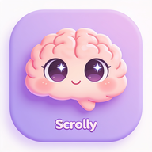
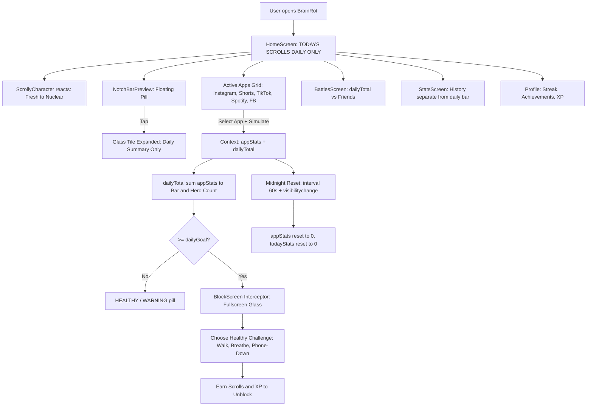
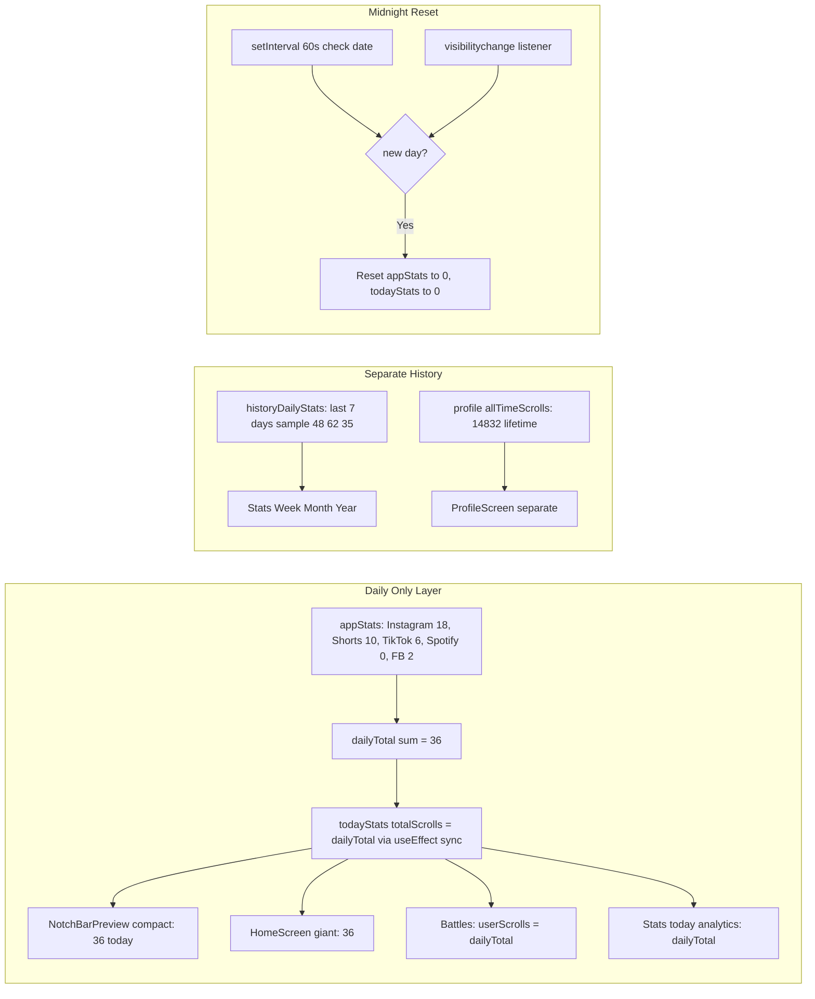
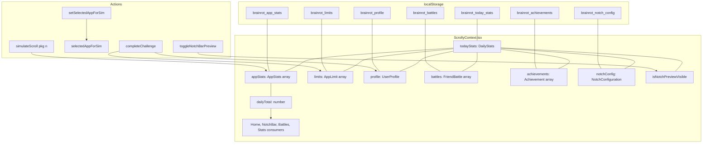
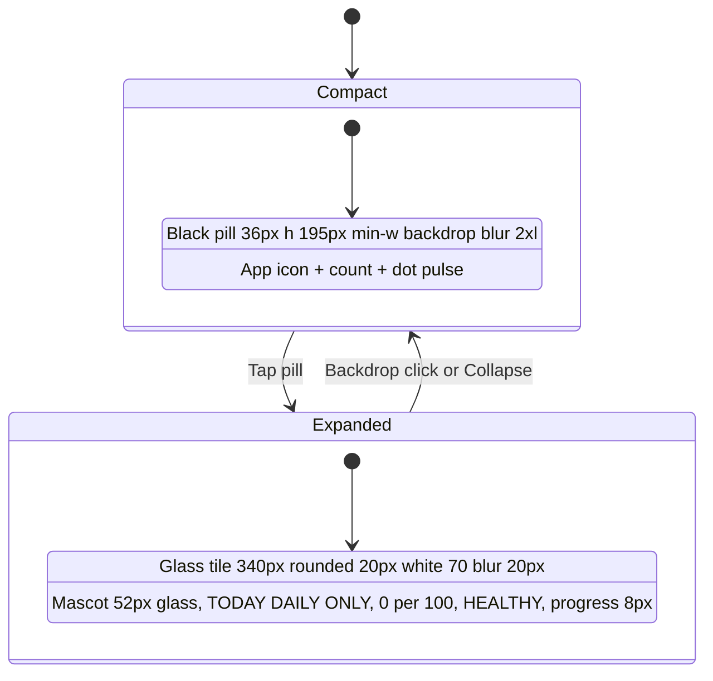
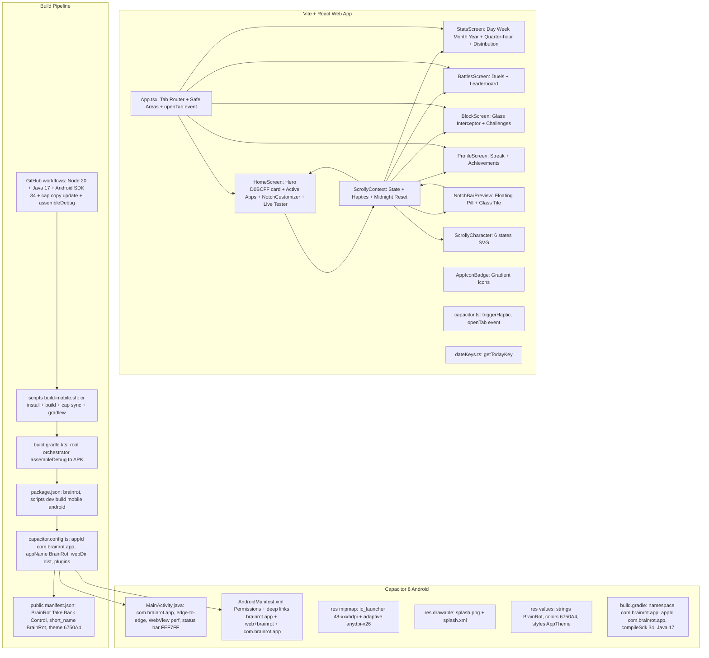
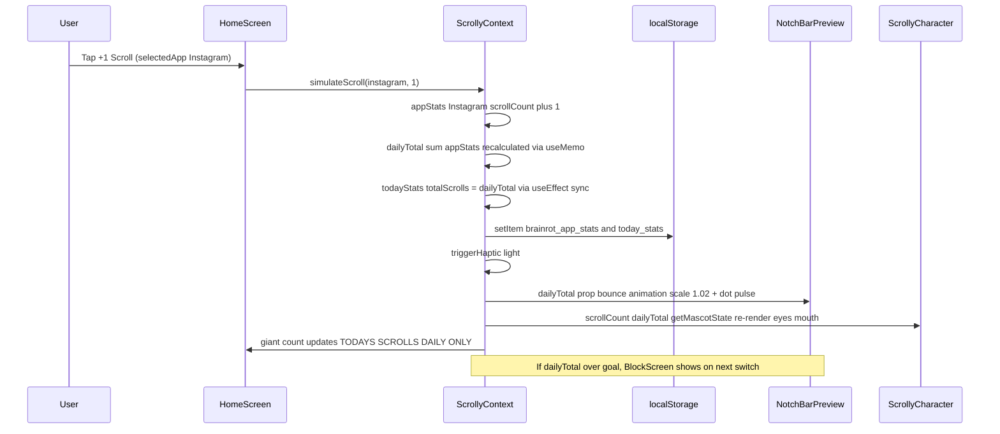

# BrainRot 🧠💜 — Take Back Control

> **See how much you scroll. Take back your attention.**
> A playful, gamified, privacy-first doomscroll tracker with a living brain mascot, glass-morphism Dynamic Island, app-level breakdowns, and friend battles.



[](https://vitejs.dev)
[](https://react.dev)
[](https://capacitorjs.com)
[](https://tailwindcss.com)
[](#-android-build)
[](#-pwa)

---

## 📖 What is BrainRot?

**BrainRot** is a **daily-only** scroll tracker that makes you *feel* your screen time. Instead of boring graphs, you get:

- A **living brain mascot** that fries as you scroll
- A **Dynamic Island / Notch Bar** floating counter that lives above Instagram, TikTok, YouTube Shorts, Facebook, Spotify
- **App-level breakdown** (how much of your brain was eaten by each app today)
- **Limits & Interceptor** that blocks you with empathy + rewards you for healthy resets
- **Friend Battles** where *less* scrolling wins
- **Streaks, XP, Achievements** to rewire habits with play, not shame

**Core principle:** The bar at the top **never** shows lifetime, weekly, or monthly totals. It is **Today • Daily Only**, resets at midnight. This prevents anxiety and keeps the intervention in the moment.

---

## 🧩 How It Works — Complete Workflow

### 1. High-Level User Journey



### 2. Daily Tracking — Source of Truth



**Rules:**
- `dailyTotal` is `useMemo(() => sum(appStats))` — never `profile.allTimeScrolls`, never `historyDailyStats`
- `todayStats.totalScrolls` is **synced** to `dailyTotal` in `useEffect`, not independently incremented
- Midnight reset: every 60s + on `visibilitychange` (when user returns to tab), if `getTodayKey() !== todayStats.date`, reset all app counts to 0
- `localStorage` keys migrated from `scrolly_*` to `brainrot_*` with fallback helper `getStoredItem()`

### 3. State Architecture



### 4. Dynamic Island — Compact vs Expanded



**Glass spec (expanded minimal):**
- `bg-white/70 backdrop-blur-[20px] border-white/70 shadow-[0_16px_40px_-12px_rgba(103,80,164,0.2), inset 0 1px 0 0 rgba(255,255,255,0.8)]`
- Mascot tile: `52px rounded 16px bg-gradient-to-br from-[#E8DEF8]/90 to-[#F3EDF7]/80 backdrop-blur-xl border-white/70`
- Progress track: `h-8px bg-[#E8DEF8]/70 backdrop-blur-xl p-2px border-white/60`, fill `from-[#D0BCFF] to-[#B69DF8]`

---

## 🏗️ Architecture Diagram



---

## 🛠️ Tech Stack — Detailed

### Frontend — Web
| Layer | Tech | Why |
|-------|------|-----|
| **Framework** | React 19 + TypeScript 5.7 | Concurrent features, type safety for daily tracking |
| **Build** | Vite 6.4 + @vitejs/plugin-react | 1943 modules, 326kB JS (95kB gzip), HMR 197ms |
| **Styling** | Tailwind CSS 4 + @tailwindcss/vite | Glass morphism via `backdrop-blur`, `bg-white/70`, gradients, no CSS files bloat (43kB CSS) |
| **Icons** | Lucide React 1.16 | Flame, Zap, Eye, Clock, Sparkles, etc. |
| **Confetti** | canvas-confetti 1.9 + @types | Achievement unlocks |
| **State** | React Context + useMemo + useEffect + localStorage | `dailyTotal` memo, midnight interval, visibilitychange, migration helper |
| **PWA** | manifest.json + vite-plugin-pwa ready | Installable, standalone, shortcuts |

### Mobile — Native Wrapper
| Layer | Tech | Details |
|-------|------|---------|
| **Runtime** | Capacitor 8.5.3 (core, android, cli) | Bridges web to native, `webDir: dist`, `androidScheme: https` |
| **App ID** | `com.brainrot.app` | Package `com.brainrot.app`, MainActivity `com/brainrot/app/MainActivity.java` |
| **Plugins** | @capacitor/app 8.1.2 | Deep links, app state, `brainrot:openTab` event |
| | @capacitor/haptics 8.0.2 | `triggerHaptic` light/medium/heavy on scrolls, tab changes |
| | @capacitor/keyboard 8.0.6 | `resize: body`, dark style |
| | @capacitor/splash-screen 8.0.2 | `backgroundColor #FEF7FF`, `splash.png`, 2s autoHide |
| | @capacitor/status-bar 8.0.4 | `style DARK`, `backgroundColor #FEF7FF`, `overlaysWebView false` |
| **Android** | Gradle 8, compileSdk 34, minSdk 24, targetSdk 34, Java 17, namespace `com.brainrot.app` | Edge-to-edge via `WindowCompat.setDecorFitsSystemWindows`, WebView hardware accel, vector drawables, ProGuard `com.brainrot.app.**` |
| **Permissions** | `INTERNET`, `ACCESS_NETWORK_STATE`, `SYSTEM_ALERT_WINDOW` (floating island), `BIND_ACCESSIBILITY_SERVICE` (future scroll detection), `REQUEST_IGNORE_BATTERY_OPTIMIZATIONS`, `VIBRATE`, `WAKE_LOCK` | Declared in `AndroidManifest.xml` |
| **Deep Links** | `https://brainrot.app`, `web+brainrot://`, `com.brainrot.app://` | AutoVerify intent-filter |

### Build & CI
| Tool | Usage |
|------|-------|
| **Root Gradle** | `build.gradle.kts` tasks: `installDependencies`, `buildWeb`, `syncCapacitor`, `assembleDebug` (web + APK), `assembleRelease`, `cleanAll`, `mobileInfo` |
| **Settings** | `settings.gradle.kts` `rootProject.name = "brainrot"` |
| **Scripts** | `scripts/build-mobile.sh` (bash, colors, Node check, npm ci, build, cap sync, gradlew assembleDebug, copy to `brainrot-debug.apk`), `scripts/generate-icons.js` (Pillow resize 48-1024) |
| **GitHub Actions** | `.github/workflows/mobile-build.yml`: `build-web` (Node 20, npm ci, lint, build, upload dist), `build-android` (Java 17 Temurin, Android SDK platform-tools 34.0.0 + platforms android-34 + build-tools 34.0.0, npm ci, build, `cap copy` + `cap update`, `./gradlew assembleDebug --stacktrace` → artifact `brainrot-debug-apk`), `build-pwa` (serve + lighthouse) |
| **Icons** | `public/icon-*.png` 48,72,96,120,144,152,180,192,512,1024 + `mipmap-hdpi..xxxhdpi` + `mipmap-anydpi-v26` adaptive + `drawable/splash.png` |

### Data & Logic
- **Daily Tracking**: `dailyTotal = useMemo sum(appStats)` → synced to `todayStats.totalScrolls` → single source for bar, hero, battles, stats today
- **Midnight Reset**: `setInterval 60s` + `document.visibilitychange` listener, checks `getTodayKey()` vs `todayStats.date`
- **Mascot States** (`ScrollyCharacter.tsx`): `getMascotState(scrollCount)` 0-20 Super Fresh, 21-50 Cruising, 51-100 Dazed, 101-200 Brain Fried, 201-500 Completely Cooked, 501+ Nuclear Brainrot
- **Notch Config**: `NotchConfiguration` type: `notchType` (dynamicIsland, centerPunch, wideNotch, waterdrop, cornerPunch, belowStatus), `placementMode` (wrapAround vs below), `cutoutGapWidth`, `offsetX/Y`
- **Challenges**: `HealthyChallenge` Touch Grass Walk 5m +15 scrolls 50XP, Phone-Down 10m +20 75XP, Box Breathing 2m +10 30XP, Stretch 3m +12 40XP
- **Battles**: `FriendBattle` lower scroll wins, `dailyTotal` vs friendScrolls, leaderboard daily
- **Achievements**: Unlock via scroll thresholds, streaks, battles

---

## 📁 Project Structure

```
BrainRot/
├── src/
│   ├── components/
│   │   ├── Navigation.tsx              # Bottom tab bar + haptics
│   │   ├── ScrollyCharacter.tsx        # 6 brain states SVG + animation
│   │   ├── AppIconBadge.tsx            # Gradient icons Instagram/Shorts/TikTok/Spotify/FB
│   │   ├── NotchBarPreview.tsx         # Dynamic Island pill + minimal glass tile (340px, white/70 blur 20px)
│   │   ├── NotchDynamicIslandCustomizer.tsx # Notch type, placement, gap, offset sliders
│   │   └── AppIconBadge.tsx
│   ├── screens/
│   │   ├── HomeScreen.tsx              # Hero D0BCFF 28px rounded, giant dailyTotal, mascot 128px, progress, Active Apps 5-col, System Setup
│   │   ├── StatsScreen.tsx             # Day/Week/Month/Year, quarter-hour, distribution, uses dailyTotal for today
│   │   ├── BattlesScreen.tsx           # Duels using dailyTotal, winning logic daily
│   │   ├── BlockScreen.tsx             # BrainRot Interceptor glass, limit sliders, challenges
│   │   └── ProfileScreen.tsx           # Streak, allTime separate, achievements, Reset all BrainRot stats
│   ├── context/
│   │   └── ScrollyContext.tsx          # dailyTotal memo, sync effect, midnight interval + visibilitychange, getStoredItem migration scrolly_* -> brainrot_*, simulateScroll daily-only, battles dailyTotal, haptics
│   ├── utils/
│   │   ├── capacitor.ts                # triggerHaptic, triggerNotificationHaptic, brainrot:openTab dispatch, isNative
│   │   └── dateKeys.ts                 # getTodayKey, getDayOffsetKey
│   ├── types/
│   │   └── index.ts                    # DailyStats, AppStats, AppLimit, Achievement, FriendBattle, UserProfile, HealthyChallenge, NotchConfiguration, NotchType, IslandPlacementMode
│   ├── App.tsx                         # Tab state ScrollyTab, safe area insets, brainrot:openTab listener, NotchBarPreview overlay
│   ├── main.tsx                        # ReactDOM, logs BrainRot native/PWA ready, Capacitor init
│   └── index.css                       # Tailwind base, mobile-first, safe-area, glass utilities
├── android/                            # Capacitor Android project
│   ├── app/
│   │   ├── src/main/
│   │   │   ├── AndroidManifest.xml     # Permissions + deep links https brainrot.app + web+brainrot + com.brainrot.app
│   │   │   ├── java/com/brainrot/app/MainActivity.java # package com.brainrot.app, edge-to-edge, WebView config, status bar #FEF7FF
│   │   │   └── res/
│   │   │       ├── drawable-*/splash.png, drawable/splash.xml, drawable/splash_icon.xml
│   │   │       ├── mipmap-*/ic_launcher.png + foreground + round
│   │   │       ├── mipmap-anydpi-v26/ic_launcher.xml + ic_launcher_round.xml
│   │   │       ├── values/strings.xml (app_name BrainRot, title_activity_main BrainRot, package_name com.brainrot.app, custom_url_scheme com.brainrot.app)
│   │   │       ├── values/colors.xml, styles.xml, ic_launcher_background.xml
│   │   │       └── xml/file_paths.xml
│   │   ├── build.gradle                # namespace com.brainrot.app, applicationId com.brainrot.app, versionCode 2 versionName 1.0.1, Java 17, buildConfig true
│   │   ├── capacitor.build.gradle
│   │   └── proguard-rules.pro          # Keep com.brainrot.app.**, com.getcapacitor.**, JavascriptInterface
│   ├── gradle/wrapper/gradle-wrapper.jar + properties
│   ├── build.gradle, settings.gradle, capacitor.settings.gradle, variables.gradle, gradle.properties
│   └── gradlew + gradlew.bat
├── public/
│   ├── manifest.json                   # name BrainRot - Take Back Control, short_name BrainRot, start_url /, display standalone, background #FEF7FF, theme #6750A4, icons 48-1024 maskable, shortcuts Stats/Battles/Block, protocol_handlers web+brainrot
│   ├── icon-48.png ... icon-1024.png
│   └── assets/aistudio/.gitignore
├── scripts/
│   ├── build-mobile.sh                 # Node check, npm ci, build, cap sync android, gradlew assembleDebug, copy to brainrot-debug.apk
│   └── generate-icons.js               # Resize icon-512 to 48-1024 via Pillow
├── .github/workflows/mobile-build.yml  # CI: build-web + build-android (Java17 + SDK34 + cap copy/update + assembleDebug) + build-pwa
├── capacitor.config.ts                 # appId com.brainrot.app, appName BrainRot, webDir dist, background #FEF7FF, plugins SplashScreen StatusBar Keyboard App
├── build.gradle.kts                    # Root orchestrator: installDependencies, buildWeb, syncCapacitor, assembleDebug (web+APK), assembleRelease, cleanAll, mobileInfo
├── settings.gradle.kts                 # rootProject.name brainrot
├── vite.config.ts                      # @vitejs/plugin-react + @tailwindcss/vite, server host 0.0.0.0 port 3000
├── index.html                          # title BrainRot - Take Back Control, meta apple-mobile-web-app-title BrainRot, application-name BrainRot, og/twitter BrainRot, theme #6750A4, viewport-fit=cover, noscript BrainRot
├── package.json                        # name brainrot, version 1.0.0, scripts dev/build/build:mobile/lint/cap:init/cap:add:android/cap:sync/cap:open:android/android:build/android:build:release/android:run/mobile:dev, deps react 19, capacitor 8.5.3, lucide-react, canvas-confetti
└── metadata.json                       # name BrainRot
```

---

## 🔄 Data Flow — Simulate Scroll Example



---

## 🎨 UI — Glassmorphism & Mascot

### Glass Tile (Expanded Minimal)
- **Container**: `340px` max `92vw`, `rounded 20px`, `bg-white/70 backdrop-blur-20px border-white/70 shadow 0_16px_40px_-12px_rgba(103,80,164,0.2) + inset 0 1px 0 0 rgba(255,255,255,0.8)`
- **Mesh**: Two blurred blobs `D0BCFF/25` and `E8DEF8/40` + white gradient overlay `from-white/60 via-white/10 to-white/20`
- **Mascot tile**: `52px rounded 16px bg-gradient-to-br from-E8DEF8/90 to-F3EDF7/80 backdrop-blur-xl border-white/70 shadow 0_4px_12px_rgba(103,80,164,0.08) + inset white`
- **Text**: `TODAY - DAILY ONLY` `10px tracking 0.12em #6750A4`, count `26px black`, `Resets midnight Not lifetime` `10px #79747E`
- **Healthy pill**: `bg-#D1F0D6 text-#0B3722 border-#A8DAB5/50 backdrop-blur-xl`
- **Progress**: `h-8px bg-#E8DEF8/70 backdrop-blur-xl p-2px border-white/60`, fill `from-#D0BCFF to-#B69DF8`

### Mascot States
| Scrolls | State | Visual |
|---------|-------|--------|
| 0-20 | Super Fresh | Crystal clear brain, sparkle anime eyes |
| 21-50 | Cruising | Chill, mindful, slight smile |
| 51-100 | Dazed | Wide-eyed, gentle reminder |
| 101-200 | Brain Fried | Dizzy spiral eyes, sweat drop |
| 201-500 | Completely Cooked | X eyes, open tongue |
| 501+ | Nuclear Brainrot | Emergency dopamine overload, red glow |

---

## 📱 Android Build — Full Guide

### Prerequisites
```
Node 20+, JDK 17+ (Temurin), Android SDK 34, Android Studio
ANDROID_HOME=$HOME/Android/Sdk
PATH=$PATH:$ANDROID_HOME/platform-tools
```

### Quick Build

```bash
# Install
npm ci

# Web only
npm run build

# Mobile web + sync
npm run build:mobile
# or
./scripts/build-mobile.sh

# Debug APK (requires JDK + SDK)
npm run android:build
# Output: android/app/build/outputs/apk/debug/app-debug.apk
#         brainrot-debug.apk (convenience)

# Release unsigned
npm run android:build:release
# Output: android/app/build/outputs/apk/release/app-release-unsigned.apk

# Run on device/emulator
npm run android:run
# Live reload
npm run mobile:dev

# Open in Studio
npm run cap:open:android
# Then Build > Build APK(s)
```

### GitHub Actions CI
On push to `main`, `master`, `arena/*`:
- `build-web`: Node 20, `npm ci`, `lint`, `build`, upload `dist/`
- `build-android`: Java 17, SDK `platform-tools + platforms;android-34 + build-tools;34.0.0`, `npm ci`, `build`, `cap copy android` + `cap update android`, `./gradlew assembleDebug --stacktrace` → artifact `brainrot-debug-apk` (14 days)
- `build-pwa`: serve dist + lighthouse audit

### Troubleshooting
- `JAVA_HOME not set` → `export JAVA_HOME=/path/to/jdk17`
- `SDK not found` → Install via Android Studio SDK Manager
- `gradlew permission denied` → `chmod +x android/gradlew`
- `Web assets not updating` → `npm run build && npx cap copy android`
- `Gradle sync failed` → `cd android && ./gradlew clean && cd .. && npx cap sync`

---

## 🔐 Permissions Explained

| Permission | Why |
|------------|-----|
| `INTERNET`, `ACCESS_NETWORK_STATE` | WebView loads `dist/` assets, future API |
| `SYSTEM_ALERT_WINDOW` | Floating Dynamic Island overlay above other apps |
| `VIBRATE` | Haptics on scrolls, tab changes, achievements |
| `REQUEST_IGNORE_BATTERY_OPTIMIZATIONS` | Keep counter alive when switching apps, <1% battery/day |
| `BIND_ACCESSIBILITY_SERVICE` | Future real scroll detection (currently simulated) |
| `WAKE_LOCK` | Screen awareness for overlay |

---

## 🌐 PWA

- **Installable** on Android/iOS/desktop: standalone display, theme `#6750A4`, background `#FEF7FF`
- **Icons**: 48,72,96,120,144,152,180,192,512,1024 + maskable 192 & 512
- **Shortcuts**: Stats, Battles, Block via `shortcuts` in manifest
- **Protocol Handlers**: `web+brainrot://`
- **Meta**: `apple-mobile-web-app-title BrainRot`, `application-name BrainRot`, `viewport-fit=cover` for safe areas
- **Offline**: Web assets cached, ready for service worker

---

## 🚀 Development

```bash
# Dev web HMR
npm run dev
# http://localhost:3000 (host 0.0.0.0)

# Lint type-check
npm run lint

# Build web
npm run build

# Preview prod
npm run preview

# Mobile dev live reload (device/emulator needed)
npm run mobile:dev
```

---

## 🔮 Roadmap

- [ ] **Real Scroll Detection**: Accessibility Service plugin for Instagram/TikTok/Shorts swipe detection
- [ ] **True Overlay Service**: Native `SYSTEM_ALERT_WINDOW` floating island that persists over other apps
- [ ] **Background Service**: Foreground service with notification, battery <1%
- [ ] **Screen Time API**: Android UsageStatsManager integration
- [ ] **iOS Build**: Capacitor iOS project, Dynamic Island Live Activities
- [ ] **Cloud Sync**: Supabase/Firebase for battles, leaderboard, cross-device streak
- [ ] **AI Insights**: Mindful nudges based on scroll patterns
- [ ] **Widgets**: Android home widget + iOS widget showing daily count

---

## 🤝 Contributing

1. Fork, create branch `feat/your-feature`
2. `npm ci && npm run dev`
3. Make changes, ensure `npm run lint` passes
4. Test daily tracking: simulate +1/+5/+20, check bar shows `dailyTotal` only, test midnight reset via changing date in `localStorage`
5. Commit with conventional commits, push, open PR to `main`

---

## 📄 License

MIT — Take back your attention! 🧠💜

Built with 💜 by BrainRot team. Original idea: Scrolly → renamed BrainRot for clarity.

---

## 🙏 Credits

- **Mascot Design**: 6-state brain SVG, anime eyes, inspired by dopamine culture
- **Glassmorphism**: Tailwind `backdrop-blur-[20px]` + `bg-white/70` + purple mesh
- **Dynamic Island**: iOS 16 inspiration, adapted for Android overlay
- **Purple Theme**: Material You `#6750A4` primary, `#D0BCFF` secondary, `#E8DEF8` surface, `#FEF7FF` background
